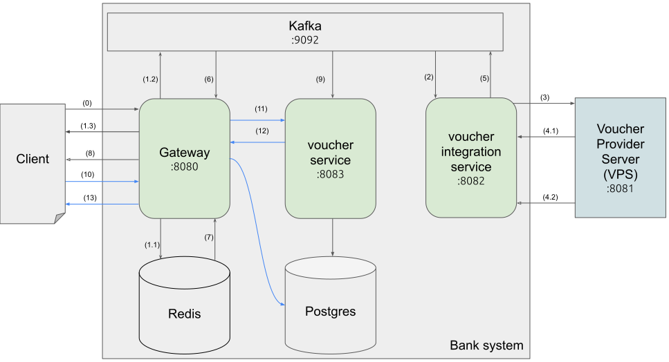

# Diagram


## Flow request for new voucher code (starts from 0-9):
(0): client requests to get new voucher code

(1.1): Gateway pushes a message to kafka server

(1.2): response to client that message is being processed within 30s

(2): voucher integration service receives message request

(3): send api request to Voucher Provider Server (VPS) to get voucher code and wait for 3s.

(4.1): within 3s, VPS responses with the voucher code or a message: "the request is being processed within 30 seconds" depending on network traffic.

(4.2): if took longer than 3s, VPS will response the voucher code via callbackUrl.

(5): upon receving voucher code, voucher int service pushes a message states that it has the voucher code.

(6): Gateway receives the code then (7) get callbackUrl from Redis

(8): send it to web/SMS base on message status.

(9): in the meantime, when voucher service receives the code then persists to DB.

## Flow customer requests to get all purchased code by phone number (starts from 10-15):
(10): client request to get all purchased code by phone number

(11): Gateway delegates the request to voucher-service

(12): voucher-service handle request then response result to Gateway

(13): Gateway response result to Client


# Implementation
Kafka topics:
- request-code
- receive-code

## Gateway:
Acts as a backend frontline, receives all requests from Client and delegates request to coresponding service.

Has:
- 1 kafka **producer** to **request-code** topic
- 1 kafka **consumer** to **receive-code** topic

## Voucher integration service:
Subscribes to request-code topic, requests to 3rd party Voucher Provider Server, handle voucher code response from VPS then publish to receive-code topic.

Has:
- 1 kafka **consumer** to **request-code** topic
- 1 kafka **producer** to **receive-code** topic

## Voucher service:
Subscribes to receive-code topic, persists voucher code to DB when receives code; handle request to get all purchased code by phone number.

Has:
- 1 kafka **consumer** to **receive-code** topic

## Security integration between Bank System and VPS
- voucher-int-service request new voucher code for a phoneNumber, request including:
    - callbackUrl: an exposed endpoint for VPS to call upon its late voucher generation response.
    - phoneNumber: client phone number
- VPS response as follow:
    - if the traffic is low (within 3 seconds) return the voucher code right away.
    - else, at 3 seconds mark, return an acknowledge response including:
        - t(codeVerifier):
        - transformMethod:
        - message: "Your request is being processed within 30 seconds".
    - return via callbackUrl:
        - if traffic is extremely heavy (took more than 30 seconds) then return a late_success response including:
            - codeVerifier
            - message: "Thank you for your patience, your voucher code is ready."
            - status: LATE_SUCCESS
            - voucherCode
        - else, response including:
            - codeVerifier
            - message: "Thank you for using our services, your voucher code is ready."
            - status: SUCCESS
            - voucherCode

[base on Proofe Key for Code Exchange protocol flow of OAuth2](https://datatracker.ietf.org/doc/html/rfc7636#section-1.1)
("client" is VPS, "Authz Server" is voucher-int-service in our use case)

# Development
## Project dependencies


## Setup
start zookeeper and kafka servers:
```bash
$ docker-compose up -d
```

# API testing
client requests for new voucher code
```bash
curl -X POST 'localhost:8080/voucher?phoneNumber=0909123456&callbackUrl=https://www.some-web.com/api/voucher-code/callback'
```

request to VPS server directly: (for debuging purpose only)
```bash
curl -X POST 'localhost:8081/api/request/voucher' \
    -H 'content-type:application/json' \
    -d '{"phoneNumber":"0909123456","callbackUrl":"http://localhost:8082/api/voucher-code/vps/response"}'
```
