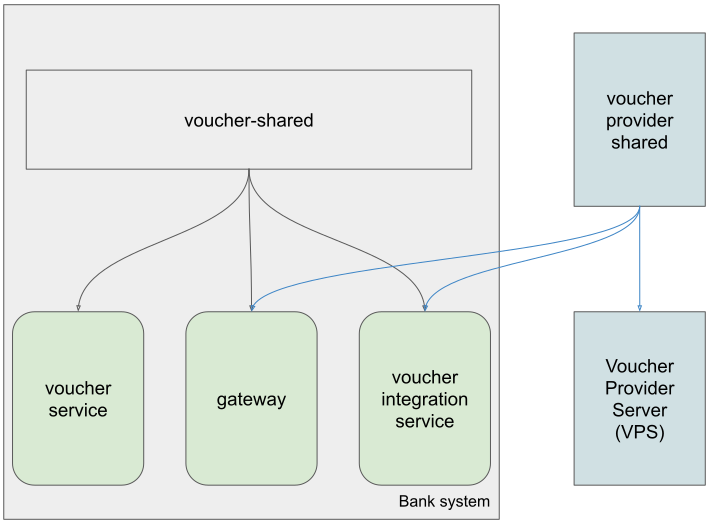

# Diagram


## Flow request for new voucher code (starts from 0-9):
(0): client requests to get new voucher code (along with callbackUrl)

(1.1): Gateway stores callbackUrl of this client request to Redis

(1.2): Gateway pushes a message to kafka server

(1.3): Gateway responses to client that message is being processed within 30s

(2): voucher integration service receives message request

(3): send api request to Voucher Provider Server (VPS) to get voucher code and wait for 3s.

(4.1): within 3s, VPS responses with the voucher code or a message: "the request is being processed within 30 seconds" depending on network traffic.

(4.2): if took longer than 3s, VPS will response the voucher code via callbackUrl.

(5): upon receving voucher code, voucher int service pushes a message states that it has the voucher code.

(6): Gateway receives the code then (7) get callbackUrl from Redis and (8) send it to web/SMS base on message status.

(9): in the meantime, when voucher service receives the code, it persists to DB.

## Flow customer requests to get all purchased code by phone number (starts from 10-15):
note: user needs to sign-in (if does not have account then sign-up) first to get the access token (jwt form) and then include this access token in their request header on protected resouces.

(10): client request to get all purchased code by phone number

(11): Gateway delegates the request to voucher-service (*)

(12): voucher-service handle request then response result to Gateway

(13): Gateway response result to Client

(*): Gateway will also handle authentication check at step (11) before deleggation, if authentication success, it will delegate request. Usually there should be a microservice for this task, however, its tasks are only for sign-up and check authentication, quite small for this assignment, so no need for new service.

# Implementation
## Kafka topics:
- request-code
- receive-code

## Gateway:
Acts as a backend frontline, receives all requests from Client and delegates request to coresponding service. Also acts as an authorization server.

Has:
- 1 kafka **producer** to **request-code** topic
- 1 kafka **consumer** to **receive-code** topic
- communication to kafka, redis, postgres and voucher-service

## Voucher integration service:
Subscribes to request-code topic, requests to 3rd party Voucher Provider Server, handle voucher code response from VPS then publish to receive-code topic.

Has:
- 1 kafka **consumer** to **request-code** topic
- 1 kafka **producer** to **receive-code** topic

## Voucher service:
Subscribes to receive-code topic, persists voucher code to DB when receives code; handle request to get all purchased code by phone number.

Has:
- 1 kafka **consumer** to **receive-code** topic
- handle gateway request to get purchased voucher codes.

## Security integration between Bank System and VPS
(TODO: improvement implementation)
- voucher-int-service request new voucher code for a phoneNumber, request including:
    - callbackUrl: an exposed endpoint for VPS to call upon its late voucher generation response.
    - phoneNumber: client phone number
- VPS response as follow:
    - if the traffic is low (within 3 seconds) return the voucher code right away.
    - else, at 3 seconds mark, return an acknowledge response including:
        - t(codeVerifier):
        - transformMethod:
        - message: "Your request is being processed within 30 seconds".
    - return via callbackUrl:
        - if traffic is extremely heavy (took more than 30 seconds) then return a late_success response including:
            - codeVerifier
            - message: "Thank you for your patience, your voucher code is ready."
            - status: LATE_SUCCESS
            - voucherCode
        - else, response including:
            - codeVerifier
            - message: "Thank you for using our services, your voucher code is ready."
            - status: SUCCESS
            - voucherCode

[base on Proof Key for Code Exchange protocol flow of OAuth2](https://datatracker.ietf.org/doc/html/rfc7636#section-1.1)
("client" is VPS, "Authz Server" is voucher-int-service in our use case)

# Development
## Service dependencies


## Setup
Bootstrap infrastructure services: zookeeper, kafka, postgres and redis, using docker compose:
```bash
$ docker-compose up -d
```

To start up services, must install shared services first because it produces common code that other services are using:
```bash
# one line command:
$ (cd voucher-provider-shared; mvn clean install); (cd voucher-shared; mvn clean install);
```
Open 4 terminal shells and start each service independently:
```bash
$ cd voucher-service; mvn;
$ cd gateway; mvn;
$ cd voucher-provider-server; mvn;
$ cd voucher-int-service; mvn;
```
There will be improvement using docker compose.

# API testing
First, sign up a new user:
```bash
curl -X POST 'localhost:8080/user/sign-up' \
    -H 'content-type:application/json' \
    -d '{"username":"batman","phoneNumber":"0909123456","password":"batpass"}'
```

Then, use jwt to requests for new voucher code
```bash
curl -X POST 'localhost:8080/voucher?phoneNumber=0909123456&callbackUrl=https://www.some-web.com/api/voucher-code/callback' \
    -H 'authorization: <jwt_value_responsed_when_sign_up>'
```

Next, If user has been inactive for more than 10mins, the access token will be expired and user has to sign in again:
```bash
curl -X POST 'localhost:8080/user/sign-in' \
    -H 'content-type:application/json' \
    -d '{"username":"batman","password":"batpass"}'
```

Finally, use the jwt token to request to get all vouchers:
```bash
curl -X GET 'localhost:8080/voucher?phoneNumber=0909123456' \
    -H 'authorization: <jwt_value_when_sign_in>'
```

Sample request to VPS server directly: (for debuging purpose only)
```bash
curl -X POST 'localhost:8081/api/request/voucher' \
    -H 'content-type:application/json' \
    -d '{"phoneNumber":"0909123456","callbackUrl":"http://localhost:8082/api/voucher-code/vps/response"}'
```

To see what data store inside postgres db:
```bash
$ docker exec -it postgres psql -U postgres bank_voucher_int

psql> \dt list all tables
psql> select * from voucher;
psql> select * from bank_user;
```

# Automation testing
Go to each project and execute these commands:
```bash
$ mvn clean test
```

To see code coverage (services only):
```bash
$ mvn jacoco:report # need file jacoco.exec, generated at $ mvn test
# test coverage is generated at: target/site/jacoco/index.html
```
